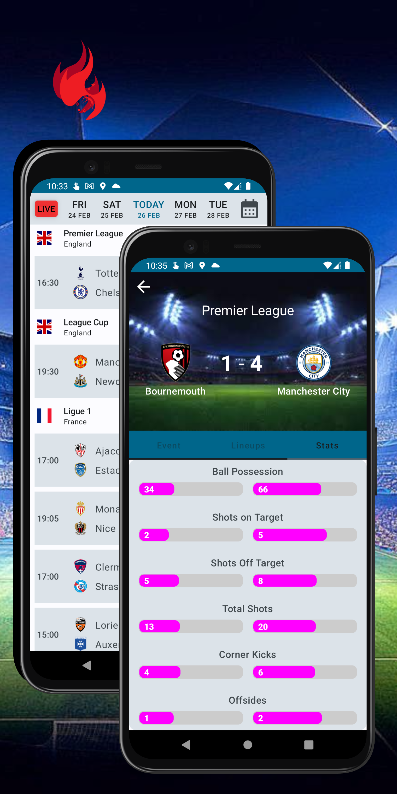
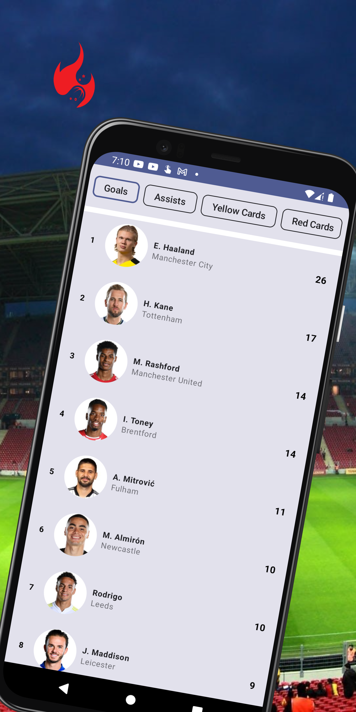
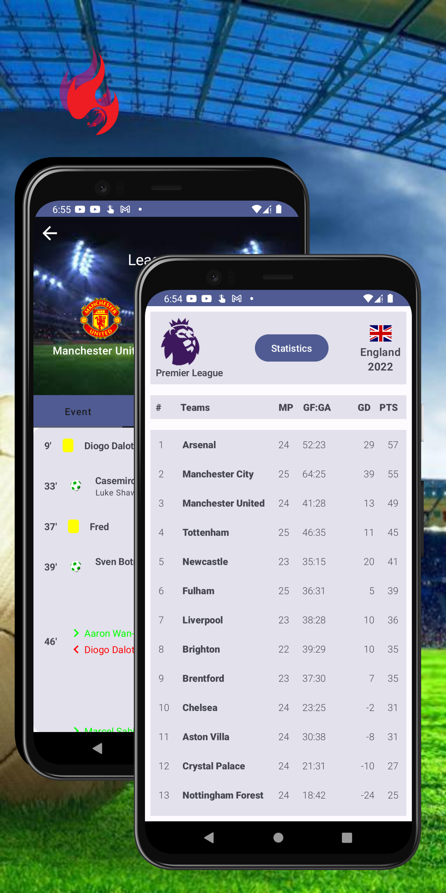
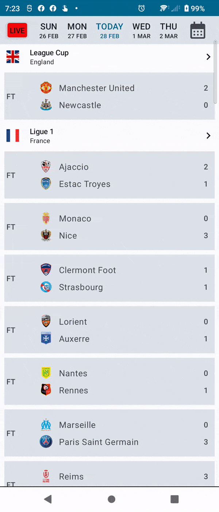
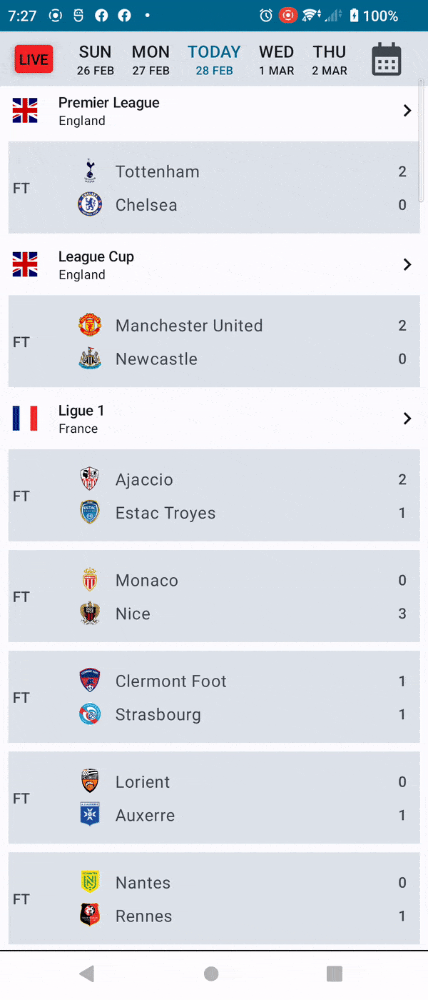
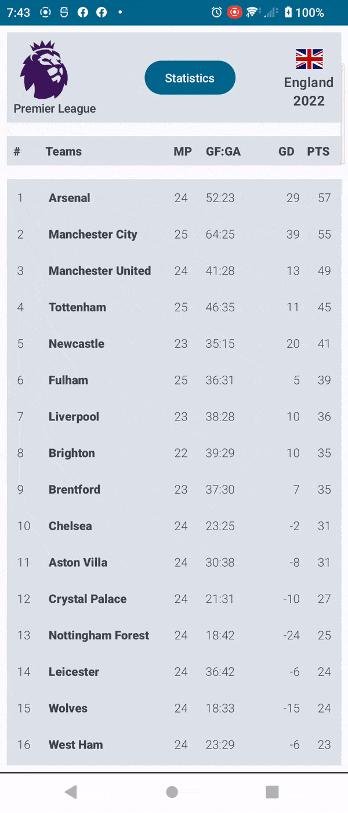

 

  

<h1 align = "center">
<b><i>Instant Scores</i></b>
</h1>

  

    Android App for Space Events
     

  
[Screenshots](#camera_flash-screenshots-camera_flash) ~
[Deployment](#inbox_tray-deployment-inbox_tray) ~
[Architecture](#hammer_and_wrench-architecture-hammer_and_wrench) ~
[API Reference](#electric_plug-api-reference-electric_plug) ~
[Tech Stack](#gear-tech-stack-gear) ~
[Authors](#black_nib-authors-black_nib) ~
 [Contributing](#passport_control-contributing-passport_control)  
 

    
Welcome to the ultimate soccer app! With Instant Scores you can access live scoress and updates from all the major soccer leagues and power tournaments around the World. From the English Premier League to La Liga, Seria A, Bundesliga and Beyond!

# :camera_flash: **Screenshots** :camera_flash:

For intuitive and consistent design patterns, this project makes use of [**MD 3**](https://m3.material.io/), a component of Google's open source design system.

 &nbsp;&nbsp;&nbsp;&nbsp;
 &nbsp;&nbsp;&nbsp;&nbsp;   
 &nbsp;&nbsp;&nbsp;&nbsp; 

# :inbox_tray: Deployment :inbox_tray:

These are the key parameters for LaunchPad app:

| Parameter      	| Value  	|
|----------------	|--------	|
| compileSdk     	| 33     	|
| targetSdk      	| 33     	|
| minSdk         	| 21     	|
| composeVersion 	| 1.3.3  	|
| kotlinVersion  	| 1.7.20 	|

You can clone the repository or download the project as a  zip file.

# :hammer_and_wrench: Architecture 	:hammer_and_wrench:

Instant Scores is implemented using Android Clean Architecture and follows the *Model-View-ViewModel* 
(MVVM) pattern.

It features :three: main layers:

**1. Data Layer** - This layer is responsible for managing data storage and dispensing data to the app. Retrofit API service provides the remote data which is then cached into the ROOM database for offline operations. Because of the deep Json nesting InstantScores incorporates JSON parsers which take a JSON string as input and converts it into a format that can be easily be manipulated. The parsers read the JSON syntax from the API, validates its correctness, and then creates a data structure in form of models. The WorkManager library helps to reliably schedule database updates periodically
 

**2. Domain Layer** - This layer holds the Business Logic for the InstantScores. It holds the models and 
the use cases that encapsulates the very complex logic for the InstatntSores app.

**3. UI Layer** - This is the presentation layer which directly interacts with the user. It displays
the  refined data to the user and facilitates interactions with the user.
It contains the ViewModels holding the different states for the InstantScoores app.

The app has :four: Screen destinations which use Compose Destination to manage navigation.

| Fixtures                            | FixtureDetails                      | Standings                           | Top Scorers                         |
|-------------------------------------|-------------------------------------|-------------------------------------|-------------------------------------|
|  |  |  |  |

### Fixtures Screen
The HomeScreen displays that day fixture which is achieved through a LazyColumn. There is also a Date Picker courtesy of [**Pranav Maganti**](https://github.com/vanpra/compose-material-dialogs)
Compose Material Dialogs Library.

### Fixture Details
The user navigates to the Fixtures Screen by clicking on a match fixture item. This screen is based on TabLayout thanks to Google's [**Accompanist Library**](https://github.com/google/accompanist). You can dig deeper into TabLayout by following its implementation on Fixtures Screen or working with the example on this provided on [*John Codeos Blog Post*](https://johncodeos.com/how-to-create-tabs-with-jetpack-compose/).

With the TabLayout you will be able to swipe between fixture events, line-ups and fixture statistics.

### Standings Screen

The user accesses the Standings Screen  by selecting the fixture's league from the main screen. There is nothing fancy here just the usual VerticalLazyColumn to display the standings.

### Topscorers Screen
This screeen displays a list of top players in goals, assists and card's category. There is an [**AssistChip**](https://m3.material.io/components/chips/guidelines#5dd1928c-1476-4029-bdc5-fde66fc0dcb1) component and the usual LazyColumn.

# :electric_plug: **API Reference** :electric_plug:
InstantScree fetches its data from [**API Sports**](https://rapidapi.com/user/api-sports).
You can find the API Documentation by following this [link](https://rapidapi.com/api-sports/api/api-football/).

### Base URL :globe_with_meridians:
https://api-football-v1.p.rapidapi.com/

### API Key :key:
You need to signup for an account with [Rapid API](https://rapidapi.com/auth/sign-up)

Additionaly you will need these 2 Header Parameters
- X-RapidAPI-Key
- X-RapidAPI-Host
### Get Fixtures By Date :inbox_tray:

`@GET(v3/fixtures?date=2023-03-03)`

This interface function takes *date* as the query and returns *FixturesResponseDTO*

| Parameter | Type   | Description                      |   |
|-----------|--------|----------------------------------|---|
| date      | String | String date in yyyy-MM-dd format |   |

### Get Fixture Datails :rocket:
`@GET(v3/fixtures?id=979139)`

This interface function takes the fixture *id* and returns *String* for processing by the Json Parser.

| Parameter | Type | Description           |
|-----------|------|-----------------------|
| id        | Int  | The id of the fixture |

### Get Standings Tables

`@GET(v3/standings?season=2022&league=39)`

This interface function takes *season* and the *id* of the league. It returns *String* for processing by the Json Parser.

| Parameter | Type | Description                       |
|-----------|------|-----------------------------------|
| season    | Int  | The year of the season in subject |
| league    | Int  | The id of the league              |

### Get Live Fixtures

`@GET(v3/fixtures?live=all)`

This interface function takes *live* and returns *String* for processing by the Json Parser.

| Parameter | Type   | Description                          |
|-----------|--------|--------------------------------------|
| live      | String | all or id-id for filter by league id |

### `@GET(v3/players/{stat_type})`
This interface function takes *stat_type* as path, *league* and *season*. It returns *String* for processing by the Json Parser.

| Parameter | Type   | Description                        |
|-----------|--------|------------------------------------|
| stat_type | String | The path to be appended to the URL |
| league    | Int    | The id of the league               |
| season    | Int    | The year of the season in subject  |
### Data Points for Launch Model

| Property        | Type     | Description                                                                   |
|-----------------|----------|-------------------------------------------------------------------------------|
| id              | Integer  | auto-generated unique identifier for the launch                               |
| name            | String   | name of the launch                                                            |
| mission         | Mission  | holds the name, type and Mission's description                                |
| imageUrl        | String   | link for the launch image                                                     |
| provider        | Provider | holds the name and Service Provider type                                      |
| status          | Status   | holds the abbreviation, name and Status description                           |
| pad             | Pad      | holds the location name, latitude, longitude, complex name and total landings |
| startWindowDate | String   | time for the start of the launch period                                       |
| rocket          | Rocket   | holds the name and rocket family                                              |

# :gear: Tech Stack :gear:

LaunchPad project uses many popular libraries and tools in the Android Ecosystem

* [Android KTX](https://developer.android.com/kotlin/ktx) - helps to write more concise, idiomatic Kotlin code.
* [Jetpack Compose](https://developer.android.com/jetpack/compose) - modern toolkit for building native Android UI
* [Material Design 2](https://m2.material.io/design) - an adaptable system of guidelines, components, and tools that support the best practices of user interface design.
* [Ramcosta Compose Destinations](https://github.com/raamcosta/compose-destinations) - used to handle all navigations and arguments passing while hiding the complex, non-type-safe and boilerplate code
* [ViewModel](https://developer.android.com/topic/libraries/architecture/viewmodel) - designed to store and manage UI-related data in a lifecycle conscious way.
* [Dagger Hilt](https://dagger.dev/hilt/) - a full static, compile-time dependency injectin framework for both Java and Android
* [Coil](https://coil-kt.github.io/coil/) - an image loading library for Android backed by Kotlin Coroutines
* [Retrofit](https://square.github.io/retrofit/) - a type-safe HTTP Client
* [Moshi](https://github.com/square/moshi) - converts data used by an application to a format that can be transfered over a network or stored in a database or a file.
* [Coroutines and Kotlin Flow](https://kotlinlang.org/docs/reference/coroutines-overview.html) - used to manage the local storage i.e. `writing to and reading from the database`. Coroutines help in managing background threads and reduces the need for callbacks.
* [Room](https://developer.android.com/topic/libraries/architecture/room) - persistence library which provides an abstraction layer over SQLite to allow for more robust database access while harnessing the full power of SQLite.
* [Paging 3](https://developer.android.com/topic/libraries/architecture/paging/v3-overview) - helps to load and display pages of data from a larger dataset and display small chunks of data in a paginated way
* [Timber](https://github.com/JakeWharton/timber) - a logger with a small, extensible API which provides utility on top of Android's normal Log class.
* [Lottie Animations](https://lottiefiles.com/) - provides Lightweight and scalable animations files
* [Google Accompanist](https://github.com/google/accompanist) - a collection of extension libraries for Jetpack Compose
* [CI/CD](https://codemagic.io/android-continuous-integration/) - Continuous integration systems let you automatically build and test your app every time you check in updates to your source control system.

# :black_nib: **Author(s)** :black_nib:

- [@Tonnie-Dev](https://github.com/Tonnie-Dev)

Do Reach Out :

  * [Twitter](https://twitter.com/Tonnie_Dev)

  * [LinkedIn](https://www.linkedin.com/in/antony-muchiri/)

# :passport_control: **Contributing** :passport_control:

Contributions to make LaunchPad better are always welcome!

If you are interested in seeing a particular feature implemented in this app, please open a new issue after which you can make a PR!

#  :scroll: **License**  :scroll:

MIT License

Copyright (c) [2022] [Tonnie Dev]

Permission is hereby granted, free of charge, to any person obtaining a copy
of this software and associated documentation files (the "Software"), to deal
in the Software without restriction, including without limitation the rights
to use, copy, modify, merge, publish, distribute, sublicense, and/or sell
copies of the Software, and to permit persons to whom the Software is
furnished to do so, subject to the following conditions:

The above copyright notice and this permission notice shall be included in all
copies or substantial portions of the Software.

THE SOFTWARE IS PROVIDED "AS IS", WITHOUT WARRANTY OF ANY KIND, EXPRESS OR
IMPLIED, INCLUDING BUT NOT LIMITED TO THE WARRANTIES OF MERCHANTABILITY,
FITNESS FOR A PARTICULAR PURPOSE AND NONINFRINGEMENT. IN NO EVENT SHALL THE
AUTHORS OR COPYRIGHT HOLDERS BE LIABLE FOR ANY CLAIM, DAMAGES OR OTHER
LIABILITY, WHETHER IN AN ACTION OF CONTRACT, TORT OR OTHERWISE, ARISING FROM,
OUT OF OR IN CONNECTION WITH THE SOFTWARE OR THE USE OR OTHER DEALINGS IN THE
SOFTWARE.

